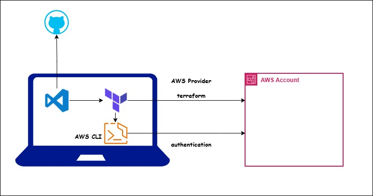

# Terraform

### Terraform

We need to understand what are the advantages and problems terraform is solving. It is popular infrastructure as a tool (IaC) tool as of now. Advantages of IaC are

* **Version Control:**  
    Since it is code, we can maintain in GIT to version control it. We can maintain complete history of development. Collaboration is easy.
 
* **Consistent Infrastructure:**  
    Often we face the problem diff configurations in different environments like DEV, QA, PROD, etc. Using terraform we can create the infrastructure in multiple environments with more reliability.

* **Automated Infra CRUD:**  
    Using terraform we can create entire infra in minutes reducing the human errors while creating manually.
    Using terraform we can update the infra easily.
    Using terraform we can delete the infra easily.

* **Inventory Management:**  
    If we create infra manually it is very tough to maintain the inventory of services. But by seeing the terraform resources anyone can know the services being used for project.

* **Cost Optimisation:**  
    When we need infra we can create in minutes. When we don't need we can destroy in minutes. Saving cost and time.

* **Automatic dependency management:**  
    Terraform can understand the dependency between resources while creating, updating and deleting.

* **Modular Infra:**  
    We can develop our own modules or use open source modules to reuse the infra code. Any one can reuse our code and create infra instead of spending more time on their own.

resource "type_of_resource" "name_of_resource"{
	key=value
}

variable "name_of_variable" {
	type = string
	default = ""
}

terraform.tfvars
ENV variables TF_VAR_VAR_NAME
-var "var_name=value"

expression ? "true_val" : "false_val"

count.index

list -> ordered,index based values -> allows duplicates
set -> order not gaurenteed, remove duplicates

count based loop -> list

for_each loop
===============
set or map
each -> special variable

count, for_each, dynamic(only for repeated code inside resource)
count -> list based
for_each -> map or set

resources
=============
For Providing the information to provider

data sources
============
For Getting the information from provider, we can use data sources

functions
=============
we can't write custom functions in terraform. But we can develop our own providers that expose function.
Numeric functions, String, Collection, encoding, filesystem

terraform console

